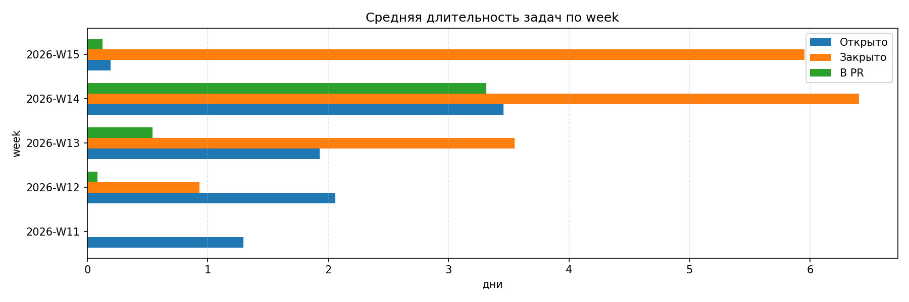
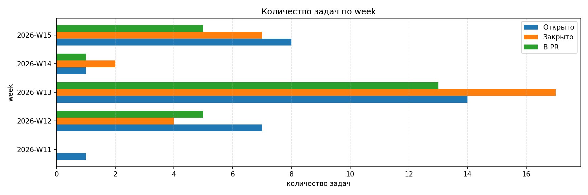

Пример вывода в консоль (в markdown маркировке):

| week | avg_open_days | avg_closed_days | avg_in_pr_days | open_count | closed_count | in_pr_count | total_open | total_closed |
| --- | --- | --- | --- | ---: | ---: | ---: | ---: | ---: |
| 2026-W11 | 1.295 | - | - | 1 | 0 | 0 | 1 | 0 |
| 2026-W12 | 2.06 | 0.931 | 0.084 | 7 | 4 | 5 | 8 | 4 |
| 2026-W13 | 1.927 | 3.549 | 0.542 | 14 | 17 | 13 | 22 | 21 |
| 2026-W14 | 3.455 | 6.407 | 3.313 | 1 | 2 | 1 | 23 | 23 |
| 2026-W15 | 0.192 | 5.955 | 0.126 | 8 | 7 | 5 | 31 | 30 |

Диаграммы:

